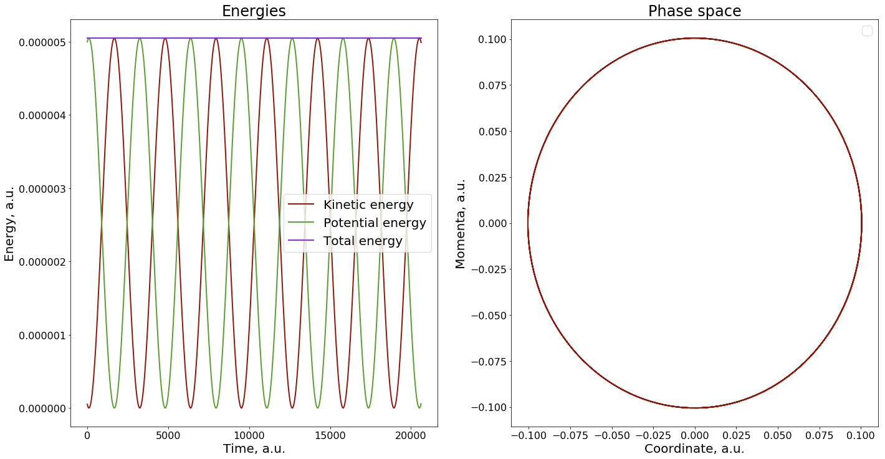

```python
import hublib.use

%use libra-4.8.1

import sys
import cmath
import math
import os

if sys.platform=="cygwin":
    from cyglibra_core import *
elif sys.platform=="linux" or sys.platform=="linux2":
    from liblibra_core import *
import util.libutil as comn

from libra_py import units
import matplotlib.pyplot as plt   # plots
#matplotlib.use('Agg')
#%matplotlib inline 

import numpy as np
#from matplotlib.mlab import griddata

plt.rc('axes', titlesize=24)      # fontsize of the axes title
plt.rc('axes', labelsize=20)      # fontsize of the x and y labels
plt.rc('legend', fontsize=20)     # legend fontsize
plt.rc('xtick', labelsize=16)    # fontsize of the tick labels
plt.rc('ytick', labelsize=16)    # fontsize of the tick labels

plt.rc('figure.subplot', left=0.2)
plt.rc('figure.subplot', right=0.95)
plt.rc('figure.subplot', bottom=0.13)
plt.rc('figure.subplot', top=0.88)

colors = {}

colors.update({"11": "#8b1a0e"})  # red       
colors.update({"12": "#FF4500"})  # orangered 
colors.update({"13": "#B22222"})  # firebrick 
colors.update({"14": "#DC143C"})  # crimson   

colors.update({"21": "#5e9c36"})  # green
colors.update({"22": "#006400"})  # darkgreen  
colors.update({"23": "#228B22"})  # forestgreen
colors.update({"24": "#808000"})  # olive      

colors.update({"31": "#8A2BE2"})  # blueviolet
colors.update({"32": "#00008B"})  # darkblue  

colors.update({"41": "#2F4F4F"})  # darkslategray

clrs_index = ["11", "21", "31", "41", "12", "22", "32", "13","23", "14", "24"]
```


```python
def derivatives(Z, params):
    ndof = Z.num_of_rows
    ntraj = Z.num_of_cols
    mass = params["mass"]     # list of dof items
    k = params["force_const"] # -
    q0 = params["q0"]         # -
        
    q = Z.real()
    p = Z.imag()
    
    der = CMATRIX(ndof, ntraj)
    
    for traj in range(ntraj):
        
        for dof in range(ndof):
            
            qi =  q.get(dof, traj)
            pi =  p.get(dof, traj)
            
            val1 = pi/mass[dof]
            val2 = -k[dof]*(qi-q0[dof])
            
            dzdt = val1*(1.0+0.0j)+val2*(0.0+1.0j)
            der.set(dof, traj, dzdt )
            
    return der
```


```python
def energies(Z, params):
    ndof = Z.num_of_rows
    ntraj = Z.num_of_cols
    
    mass = params["mass"]     # list of dof items
    k = params["force_const"] # -
    q0 = params["q0"]         # -
        
    q = Z.real()
    p = Z.imag()
    
    ekin, epot = 0.0, 0.0
    
    for traj in range(ntraj):        
        for dof in range(ndof):
            
            qi =  q.get(dof, traj)
            pi =  p.get(dof, traj)   
            
            ekin += 0.5*pi*pi/mass[dof]
            epot += 0.5*k[dof]*(qi-q0[dof])**2
    ekin = ekin / ntraj
    epot = epot / ntraj
    
    etot = ekin + epot
    
    return ekin, epot, etot
```


```python
def plot(T, Ekin, Epot, Etot, q, p):
    
    #======== Now lets plot what we have computed ===========
    plt.figure(1, figsize=(24, 12)) # dpi=300, frameon=False)
    plt.subplot(1,2,1)
    plt.title('Energies')
    plt.xlabel('Time, a.u.')
    plt.ylabel('Energy, a.u.')
    plt.plot(T, Ekin, label='Kinetic energy', linewidth=2, color = colors["11"]) 
    plt.plot(T, Epot, label='Potential energy', linewidth=2, color = colors["21"]) 
    plt.plot(T, Etot, label='Total energy', linewidth=2, color = colors["31"]) 
    plt.legend()

    plt.subplot(1,2,2)
    plt.title('Phase space')
    plt.xlabel('Coordinate, a.u.')
    plt.ylabel('Momenta, a.u.')
    plt.plot(q, p, label='', linewidth=2, color = colors["11"])     
    plt.legend()
        
    plt.show()
    plt.close()
```


```python

def run_simulations():
    
    # Initial conditions
    Z = CMATRIX(1, 1)
    Z.set(0,0, 0.1+0.01j)

    # Potential
    params = {"mass":[1000.0], "force_const":[0.001], "q0":[0.0]}

    # Simulation parameters
    dt = 1.0*units.fs2au
    nsteps = 500

    T, Ekin, Epot, Etot, q, p = [], [], [], [], [], []
    for step in range(nsteps):    
        ekin, epot, etot = energies(Z, params)
    
        T.append(step*dt)
        Ekin.append(ekin)
        Epot.append(epot)
        Etot.append(etot)
        q.append(Z.get(0,0).real)
        p.append(Z.get(0,0).imag)
        #print(F"step = {step} ekin = {ekin} epot = {epot} etot = {etot}")
    
        Z = RK4(Z, dt, derivatives, params)
    
    return T, Ekin, Epot, Etot, q, p
```


```python
T, Ekin, Epot, Etot, q, p = run_simulations()
```


```python
plot(T, Ekin, Epot, Etot, q, p)
```

    No handles with labels found to put in legend.




